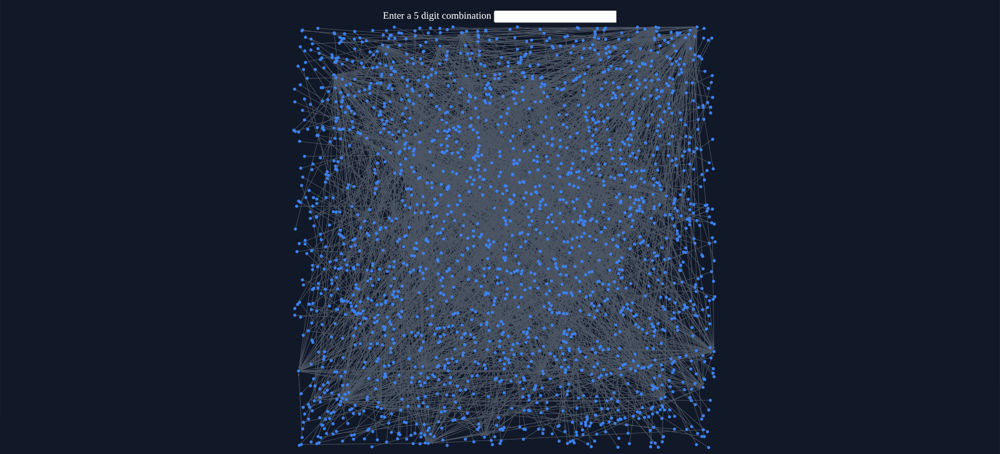

Kaprekar's algorithm takes a number and rearranges the digits, subtracting the smallest possible arrangement from the largest possible arrangement. This project implements a graph visualising this process for five digit numbers. Ultimately it will aim to show that the process converges to 3 distinct cycles for any combination of 5 digits.

Installation: npm install && python3 graph_generator.py && npm run dev

